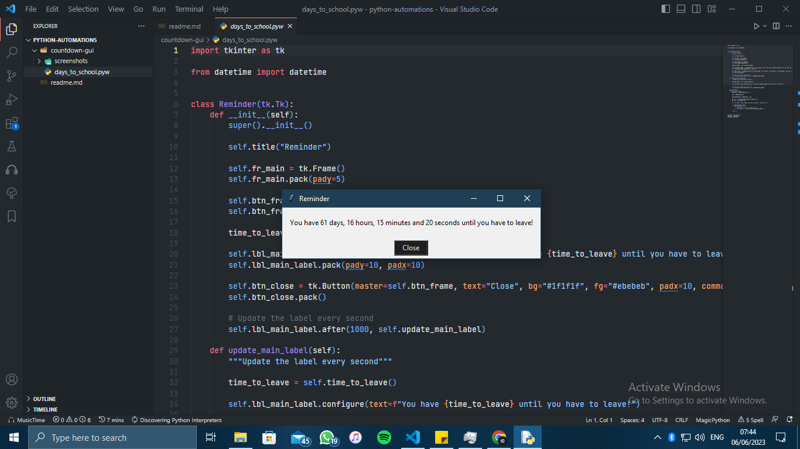
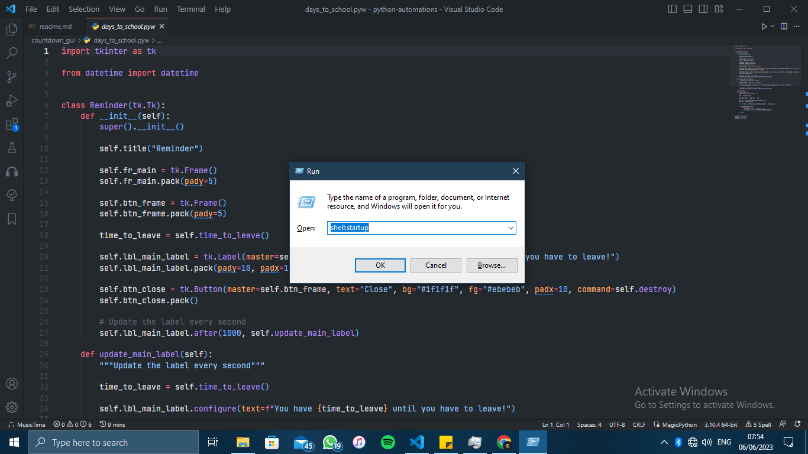
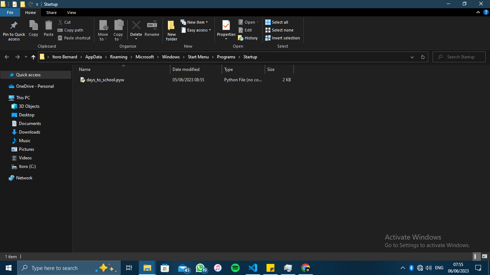

# Python Automation Projects

Welcome to my Python Automation Projects repository! 🐍✨

Here, you will find a collection of diverse Python automation projects that I wrote to simplify my life and boost my productivity. Each project showcases the power of automation using Python, demonstrating how we can delegate repetitive tasks to our trusty machines and save valuable time.

## Table of Contents

- [Countdown GUI](#countdown-gui)
- [Website Availbility Checker](#website-availability-checker)
- [Contributing](#contribution-guidelines)


## Countdown GUI



The **Countdown GUI** is a simple graphical user interface created using Python's tkinter GUI toolkit, where you can track the days until a specific event, such as the start of a new semester or an upcoming vacation.

### Key Features

- Intuitive GUI: Well, I know the universal definition of intuitive, but I'll still assert that the UI is intuitive. The user-friendly interface allows you to easily view the countdown.

- Automation Potential: This project illustrates how Python can automate time-related tasks, providing a practical example of leveraging technology to simplify your schedule.

    A real example of how this could be automated is to set it to launch after every PC startup. For windows:

    - Launch *Run* using `Win+R`
    - In the prompt that opens, type `shell:startup` and click OK
    

    - Add the script to the folder that comes up. Now every time your PC starts up, the script will run to display the countdown GUI.
    

### Getting Started

To explore the **Countdown GUI** project, follow these steps:

1. Clone this repository to your local machine.
2. Navigate to the `countdown_gui` folder.
3. Run the Python script `countdown_gui.pyw` to launch the application.
4. Enjoy the countdown experience and experiment with customisations!

**Disclaimer:** The countdown GUI project is for demonstration purposes only and should not be considered a full-fledged application for critical events or time-sensitive tasks. It is advisable to perform adequate testing and customisation for your specific needs before relying on it for important deadlines or events.

---

## Website Availability Checker

This project is a simple Python script that allows you to check the availability of a website. It sends HTTP requests to the specified URL and determines if the websites are online or experiencing any issues. Additionally, it provides load time information and sends notifications using `plyer`.

### Dependencies

To run the Website Availability Checker, you need to have the following dependencies installed:

- Python 3.x
- requests library
- plyer library

You can install the required dependencies using `pip`. Run the following command:

```python
pip install requests plyer
```

### Usage

1. Clone the repository or download the source code to your local machine.

2. Navigate to the project directory in your command line or terminal.

3. In your command line or terminal, run the following command:

   ```bash
   python website_availability_checker.py
   ```

   The script will start checking the availability of the specified websites every 5 minutes and display the results, including the load time of each website.

4. The script will also send desktop notifications using `plyer` to notify you about the website status. Ensure that you have the necessary permissions set to receive notifications.

### Customisation

You can customise the behaviour of the Website Availability Checker script based on your requirements. Here are some options:

- **Interval**: By default, the script checks the websites every 5 minutes. You can modify this value by locating and modifying this part of the code (time is in milliseconds):

    ```python
    # Schedule the check to run in 5 minutes
    if self.chb_variable_state.get() and result_text[1]:
        self.after(300000, self.check_website_availability)

    ```

- **Notifications**: The script utilises `plyer` to send desktop notifications. You can customise the notification behaviour by modifying the notification code in the script. For example, you can change the notification message.

- **Error Handling**: The script handles common exceptions and provides basic error handling. You can enhance the error handling logic to address specific scenarios or error types that you encounter.

Please note that the Website Availability Checker is a basic implementation and may not handle all scenarios or account for complex network configurations. It is recommended to enhance and customise the script based on your specific requirements.

---

# Django Workflow Automation Script

This script automates the setup of a Django project within a virtual environment. It handles the creation of a virtual environment, installation of required packages, initialisation of the Django project, and generation of configuration files such as `.env` and `requirements.txt`.

## Features

- **Virtual Environment Management**: Creates a Python virtual environment if one doesn't already exist.
- **Package Installation**: Automatically installs necessary Python packages (`Django`, `python-decouple`, `requests`).
- **Django Project Initialisation**: Sets up a new Django project with a single command.
- **Environment File Creation**: Generates a basic `.env` file for environment variables.
- **Requirements File Creation**: Creates a `requirements.txt` file listing all installed packages in the virtual environment.
- **Coloured Error Messages**: Provides clear, coloured error messages if the script is not run within a virtual environment.

## Prerequisites

- Python 3.x must be installed on your system.
- The `pip` package manager should be available.

## Usage

1. **Clone the Repository** (if applicable):
    ```bash
    cd django-workflow
    ```

2. **Run the Script**:
    Replace `'myproject'` with your desired Django project name.
    ```bash
    python django_workflow.py
    ```

3. **Script Execution**:
    - **Virtual Environment**: The script checks if a virtual environment named `venv` exists in the current directory. If not, it creates one.
    - **Activation Check**: The script ensures it is being run inside an activated virtual environment.
    - **Package Installation**: Installs `Django`, `python-decouple`, and `requests`.
    - **Django Project Setup**: Initializes a new Django project in the current directory.
    - **File Creation**: Generates a `.env` file and a `requirements.txt` file listing all installed packages.

## Error Handling

- If the script is not run within an activated virtual environment, it will terminate and display an error message in red, indicating that the environment needs to be activated.

## Customization

- **Virtual Environment Name**: You can change the default virtual environment name (`venv`) by modifying the `venv_name` parameter in the `create_venv` method.
- **Package List**: Modify the `install_packages` method if you need to install additional Python packages.

## Example Output

```bash
Virtual environment created successfully!
Virtual environment is activated.
Installed packages: Django, python-decouple, requests
Django project `myproject` has been initialized!
.env file has been created.
Installed packages have been written to requirements.txt.
```

---

## Contribution Guidelines

I encourage you to contribute your own automation projects to this repository! Whether it's a small script or a complex application, your creations can inspire and empower others to embrace automation. To contribute, please follow these guidelines:

- Fork this repository and create a new branch for your project.
- Add your project to the appropriate category or create a new one if needed.
- Include a brief description, instructions for usage, and any relevant dependencies.
- Provide clear documentation and comments in your code to aid understanding.
- Submit a pull request, and I'll review your contribution as soon as possible.

Let's automate and simplify our lives together with the power of Python!

Happy coding! 🚀✨

---

Note: This README file serves as a general record for Python automation projects. As the repository grows, you'll find an array of exciting projects covering various aspects of automation. Stay tuned for updates and feel free to explore the existing projects or contribute your own.

For any questions or suggestions, please reach out to me. We're here to support and inspire each other in our automation journeys.
